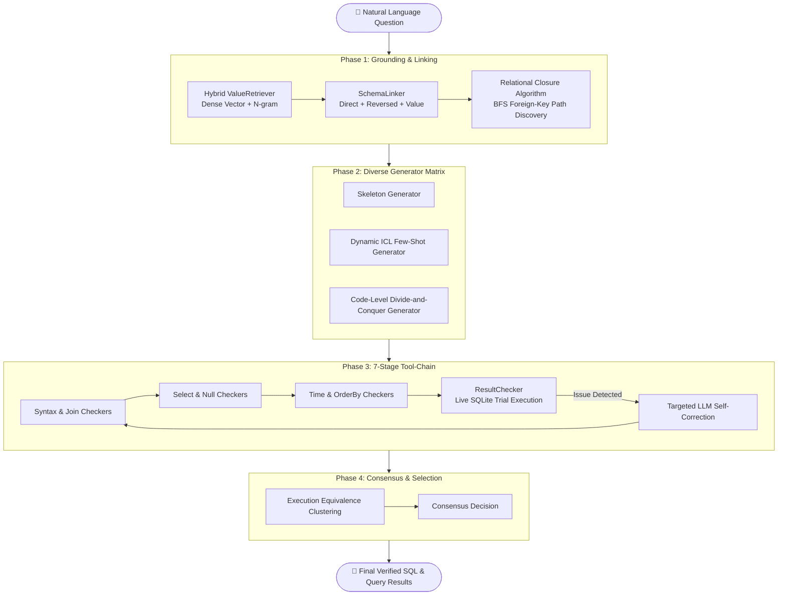

# 🔍 NL2SQL: Multi-stage Agent Pipeline for Text-to-SQL

<div align="center">

<p align="center">
  <strong>A production-ready, multi-stage agentic engine that translates complex natural language queries into accurate, executable SQL with automated semantic grounding, multi-generator consensus, and deterministic unit testing.</strong>
</p>

[](https://www.python.org/)
[](https://github.com/MuYuan88ya/NL2SQL/actions)
[](https://github.com/MuYuan88ya/NL2SQL)
[](https://sqlite.org/)
[](https://github.com/tobymao/sqlglot)
[](LICENSE)
[](https://github.com/psf/black)

[Key Capabilities](#-key-capabilities) • [System Architecture](#-system-architecture) • [Getting Started](#-getting-started) • [CLI & Interactive REPL](#-cli--interactive-repl) • [Verification & Tests](#-verification--test-suite) • [Project Structure](#-project-structure) • [Roadmap](#-roadmap)

</div>

---

## 💡 Overview

**NL2SQL** is a robust, agentic Text-to-SQL system engineered to bridge the gap between natural human language and complex relational database schemas. While standard zero-shot LLM prompting frequently struggles with missing join paths, unfamiliar acronyms, null-comparison pitfalls, and invalid database syntax, NL2SQL enforces a **multi-stage, self-correcting agent pipeline**:

$$\text{User Query} \xrightarrow{\text{Grounding}} \text{Linked Schema} \xrightarrow{\text{N-Version}} \text{Candidate SQLs} \xrightarrow{\text{Unit Testing}} \text{Verified SQL} \xrightarrow{\text{Selection}} \text{Final Executable Result}$$

> **Design Background**: The core design principles of this pipeline are inspired by the multi-stage decomposition methodology presented in the DeepEye-SQL research literature (*arXiv:2510.17586*), expanding it into an extensible, fully-functional codebase featuring hybrid vector grounding, AST-level static analysis, trial execution self-correction, and interactive developer tooling.

---

## ⚡ Key Capabilities

### 🔗 1. Graph-Based Relational Closure
- When users ask questions requiring multiple tables, single-pass models often omit intermediate linking tables (e.g. attempting to join `students` directly to `courses` without the `enrollments` junction table).
- NL2SQL models the database schema as an **undirected foreign-key topological graph**.
- Using **BFS shortest-path discovery**, the engine calculates the relational closure of all candidate tables, automatically discovering and including all necessary intermediate tables into the generation context.

### 🧠 2. Hybrid Dense & Lexical Value Grounding
- Indexes textual columns across the target database.
- Combines **Dense Vector Embeddings** (cosine similarity) with **Multi-gram / Token Jaccard Lexical Matching**.
- Accurately grounds slang, synonyms, and abbreviations (e.g. matching `"CS"` or `"CompSci"` to `"Computer Science"`) to exact database cell values.

### 🧩 3. N-Version Heterogeneous Generator Matrix
Generates multiple candidate solutions via decoupled, complementary paradigms:
- **Skeleton-based Generator**: Builds the query skeleton first (`SELECT ... FROM ... WHERE ...`), then performs constrained slot filling.
- **Dynamic Few-Shot ICL Generator (DAIL-SQL paradigm)**: Evaluates content-weighted query similarity to dynamically select the most relevant demonstration examples from a curated pool.
- **Code-level Divide-and-Conquer (D&C) Generator**: Automatically evaluates query complexity. Complex queries are explicitly split into isolated sub-problems (e.g. subqueries, CTEs) and modularly solved before final assembly.

### 🛡️ 4. 7-Stage Deterministic Tool-Chain & Trial Execution
Every candidate query is validated by a deterministic verification battery before acceptance:
1. `SyntaxChecker`: Validates dialect-specific grammar using SQLGlot AST transpilation.
2. `JoinChecker`: Enforces mandatory `ON` conditions across all joined tables.
3. `SelectChecker`: Intercepts `SELECT *` anti-patterns to enforce explicit column projections.
4. `NullChecker`: Identifies dangerous `= NULL` comparisons and `NOT IN (SELECT ...)` null traps.
5. `TimeChecker`: Replaces non-SQLite dialect functions (`YEAR()`, `NOW()`, `DATEDIFF()`) with `strftime()` equivalents.
6. `OrderByChecker`: Catches missing or empty ordering criteria.
7. `ResultChecker`: **Performs live trial executions against SQLite**, catching execution crashes, 0-row empty sets, and all-NULL outputs to trigger targeted LLM self-correction.

### 💻 5. Interactive REPL & Pretty Table Rendering
- Built-in interactive console allows continuous querying without restarting.
- Built-in `--execute` mode executes queries against the database and formats results into clean, styled tables using `tabulate`.

---

## 🏛️ System Architecture



---

## 🚀 Getting Started

### 1. Installation

The codebase supports setup using [`uv`](https://github.com/astral-sh/uv) (fastest) or standard `pip`:

```bash
# Clone the repository
git clone https://github.com/MuYuan88ya/NL2SQL.git
cd NL2SQL

# Option A: Using uv (Recommended)
uv venv
uv sync

# Option B: Using standard pip
python -m venv .venv
source .venv/bin/activate  # On Windows: .venv\Scripts\activate
pip install -e .
```

### 2. Initialize Sample Database

Create and seed the demonstration database (`school.db`):

```bash
python create_dummy_db.py
```

### 3. Configure Model Credentials

Create a `.env` file in the root directory or export your environment variables:

```env
OPENAI_API_KEY="your-api-key-here"
OPENAI_BASE_URL="https://api.openai.com/v1"  # Optional: custom base URL or proxy
OPENAI_MODEL_NAME="gpt-4o"                  # Compatible with gpt-4o, gemini, deepseek-chat, etc.
```

---

## 💻 CLI & Interactive REPL

The CLI entrypoint `main.py` provides versatile flags for both automated and interactive workflows:

```bash
python main.py --help
```

### Options

| Flag | Short | Description |
| :--- | :--- | :--- |
| `--question` | `-q` | Input a natural language question (Default: `"Show me all students"`) |
| `--execute` | `-e` | Execute the generated query and print results in a styled table |
| `--interactive`| `-i` | **Launch the interactive multi-turn REPL console** |
| `--schema` | `-s` | Display database DDL schema and exit |
| `--db` | - | Path to target SQLite database (Default: `./school.db`) |

### Example 1: View Database Schema
```bash
python main.py -s
```

### Example 2: Query with Tabular Execution
```bash
python main.py -q "List student names and grades for students taking Computer Science courses" -e
```

*Output:*
```text
==================================================
FINAL SQL: 
SELECT students.name, enrollments.grade 
FROM students 
JOIN enrollments ON students.student_id = enrollments.student_id 
JOIN courses ON enrollments.course_id = courses.course_id 
WHERE courses.department = 'Computer Science';
==================================================

Execution Result:
╭──────────────┬───────╮
│ name         │ grade │
├──────────────┼───────┤
│ Alice Smith  │ A     │
│ David Wilson │ A     │
│ David Wilson │ A     │
╰──────────────┴───────╯
```

### Example 3: Interactive REPL Mode
```bash
python main.py -i
```
```text
============================================================
🤖 DeepEye-SQL Interactive Console (REPL)
💡 Type your question to generate SQL. Type 'exit' or 'quit' to quit.
============================================================

📝 Enter query > Which course has the highest number of students?
```

---

## 🧪 Verification & Test Suite

The codebase comes with a comprehensive suite of unit tests verifying all core algorithmic components:

```bash
# Run all unit tests
python -m unittest discover -s tests

# Or with uv
uv run python -m unittest discover -s tests
```

*Status: **22 / 22 Tests Passing (100% Passing)**.*

| Test Module | Component Under Test | Status |
| :--- | :--- | :---: |
| `tests/test_schema_linking.py` | Relational Closure, BFS Path Discovery, DDL Graph Parsing | ✅ PASS |
| `tests/test_checkers.py` | Syntax, Join, Select, Null, Time, OrderBy, ResultChecker | ✅ PASS |
| `tests/test_value_retrieval.py` | Indexing, Cosine Similarity, Multi-gram Fuzzy Matching | ✅ PASS |
| `tests/test_generators.py` | Dynamic ICL Demo Selection, Content Weighting, Code-level D&C | ✅ PASS |

---

## 📁 Project Structure

```text
NL2SQL/
├── deepeye/                        # Core NL2SQL engine package
│   ├── __init__.py
│   ├── core.py                     # Pipeline orchestrator
│   ├── schema_linking.py           # Schema linking & BFS relational closure (Task 1.1)
│   ├── checkers.py                 # 7-stage deterministic tool-chain checkers (Task 1.2~1.4)
│   ├── value_retrieval.py          # Hybrid dense & lexical value grounding (Task 2.1)
│   ├── generators.py               # N-version generators & dynamic ICL (Task 2.2~2.3)
│   ├── selection.py                # Confidence-aware clustering & selection
│   └── utils.py                    # DB utilities, retry logic & prompt templates
├── tests/                          # Automated unit test suite
│   ├── test_schema_linking.py
│   ├── test_checkers.py
│   ├── test_value_retrieval.py
│   └── test_generators.py
├── paper/                          # Referenced literature
│   ├── document.md
│   └── 2510.17586v2.pdf
├── create_dummy_db.py              # Sample database generation script
├── main.py                         # Unified CLI & Interactive REPL
├── task_backlog.md                 # Project development roadmap & progress
├── implementation_gap_analysis.md  # Architectural gap analysis
└── pyproject.toml                  # Package metadata & dependencies
```

---

## 🗺️ Roadmap

Tracked via [task_backlog.md](task_backlog.md):

- [x] **Phase 1: Schema Linking & Rule Checkers (P0)**
  - [x] Task 1.1: Foreign-key relational closure algorithm (`SchemaLinker`)
  - [x] Task 1.2: SQL trial execution & `ResultChecker`
  - [x] Task 1.3: `SelectChecker` & `NullChecker`
  - [x] Task 1.4: `TimeChecker` dialect adaptation & `OrderByChecker`
- [x] **Phase 2: Semantic Retrieval & Dynamic ICL (P1)**
  - [x] Task 2.1: Hybrid dense vector & lexical `ValueRetriever`
  - [x] Task 2.2: DAIL-SQL dynamic few-shot demonstration retriever
  - [x] Task 2.3: Code-level Divide-and-Conquer generator
- [ ] **Phase 3: Confidence-Aware Selection & Evaluation (P2)**
  - [ ] Task 3.1: Selection with Cognitive Prior and pairwise win-rate adjudication
  - [ ] Task 3.2: Benchmark evaluation script for Spider / BIRD

---

## 📄 License

This project is licensed under the [MIT License](LICENSE). Contributions, issues, and feature suggestions are always welcome!
